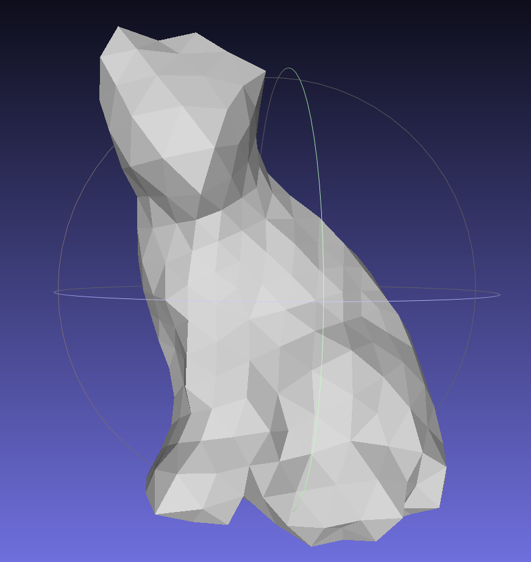
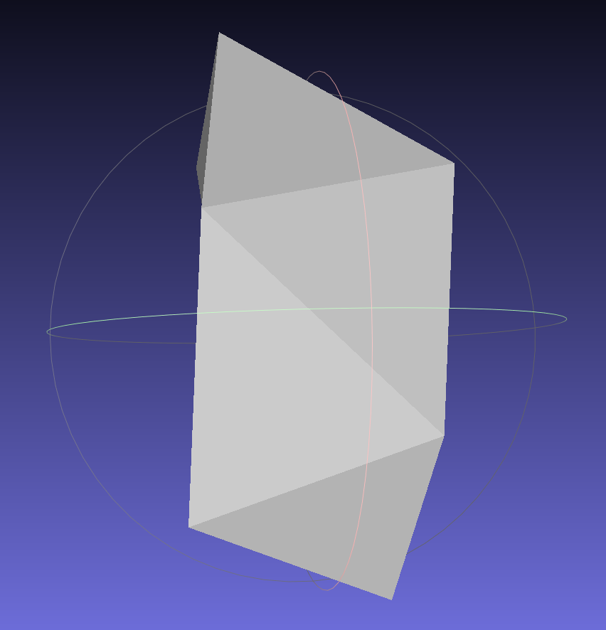
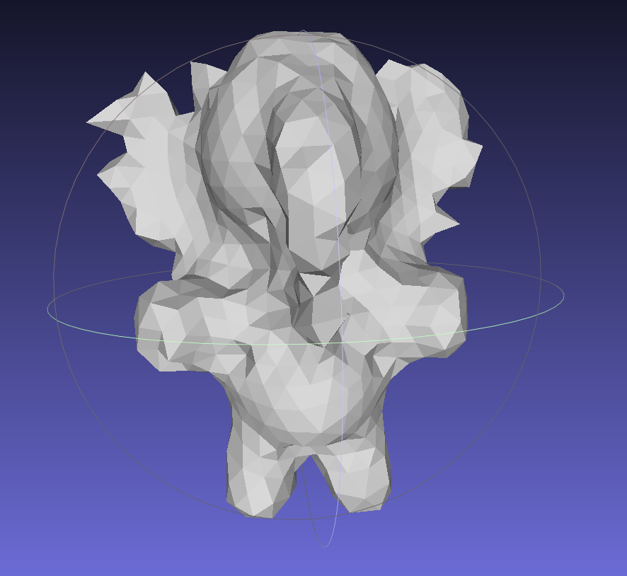
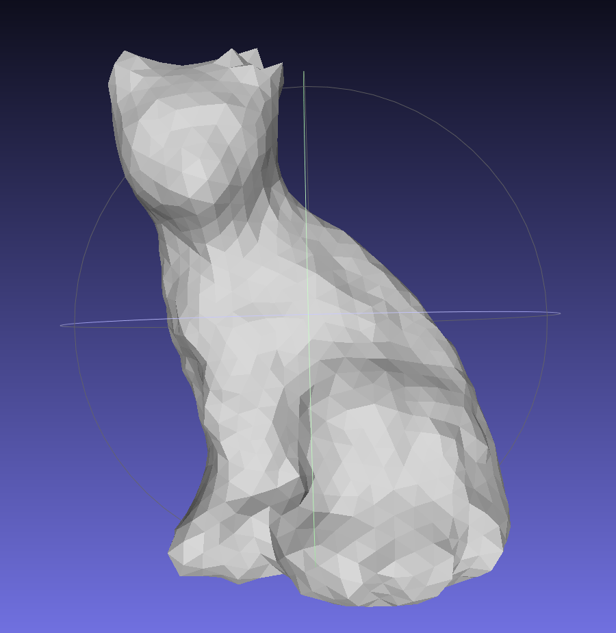
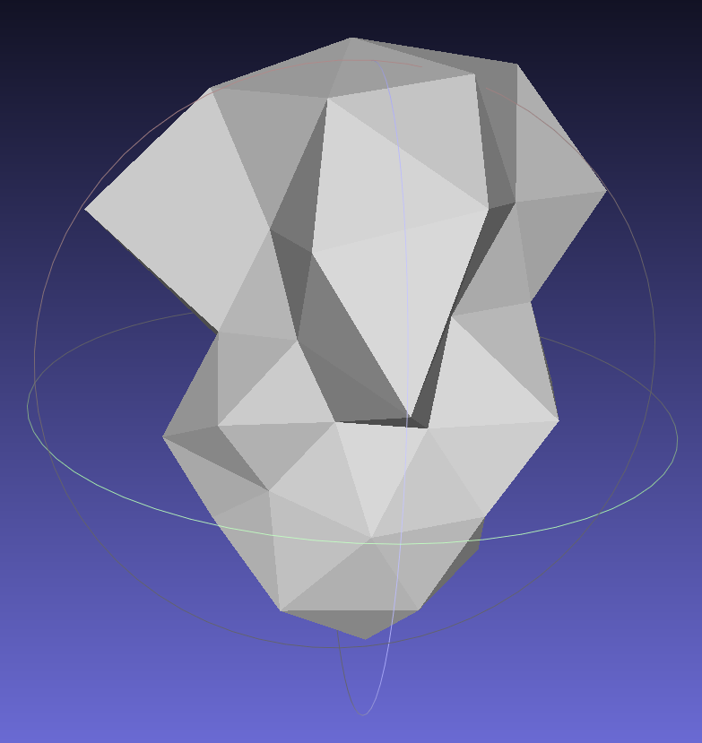
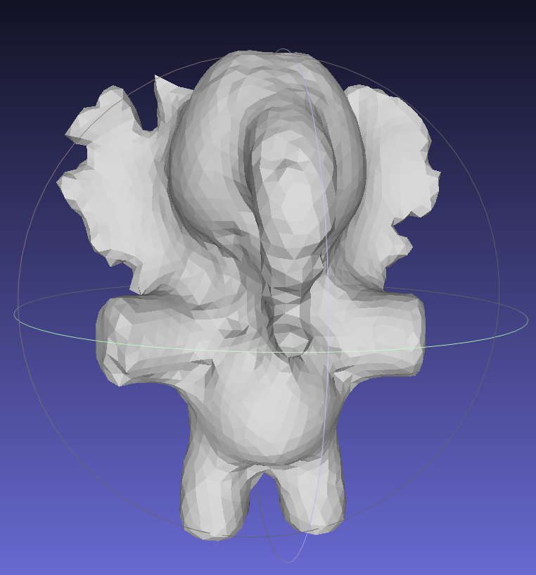
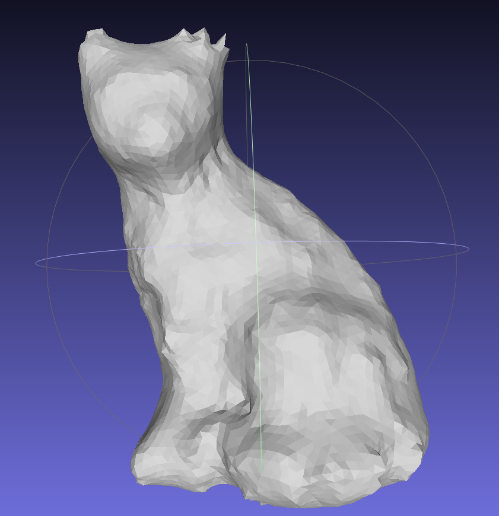
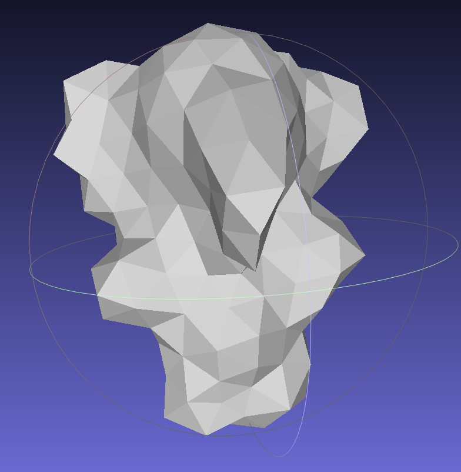
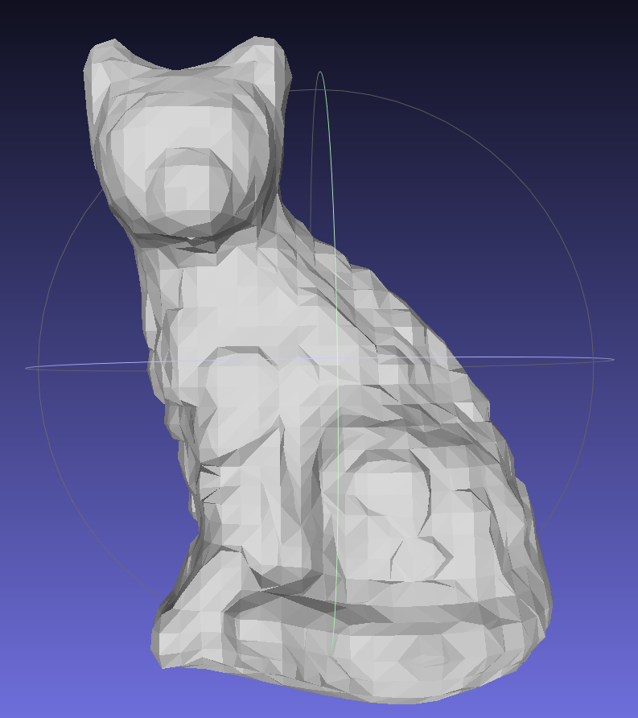
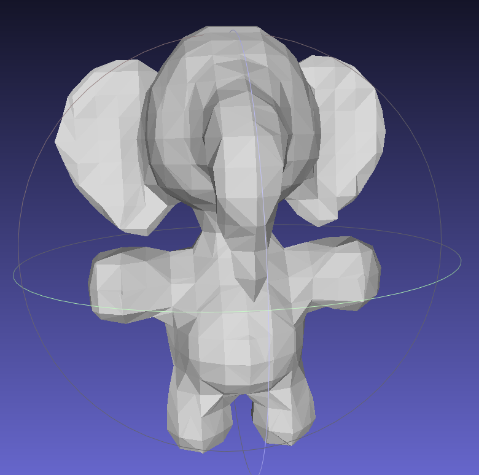

# Tiny_Sphere

I reproduced the paper Reach for the Spheres: Tangency-Aware Surface Reconstruction of SDFs here. Feel free to use this code.

For the SDF file, I generated them by my another repository code, you can have a look at https://github.com/alecjacobson/geometry-processing-mesh-reconstruction. I can't post the code since the course policy.

# Results

| Model | Cat(32x39x46) | Elephant(26x34x32) |  Elephant(42x62x56) |
| -- | -- | -- | -- |
| pass 1 |  |  |  |
| pass 2 |  |  |  |
| pass 3 |  |  | |
| ground truth |  |  |  |